# AST9 Health Hub — System Documentation

In-depth technical documentation for the AST9 Health Hub platform.
This file is the **engineering reference**: architecture, data model,
RLS, request lifecycles, asset loading, AI fallbacks, and permissions.

For project overview and quick-start see [`README.md`](./README.md).
For day-to-day developer workflows see [`Development.md`](./Development.md).

---

## Table of Contents

- [1 · High-Level Architecture](#1--high-level-architecture)
- [2 · The Two-Layer Browser Stack](#2--the-two-layer-browser-stack)
- [3 · Data Model](#3--data-model)
- [4 · Row Level Security](#4--row-level-security)
- [5 · Authentication & Permissions](#5--authentication--permissions)
- [6 · Request Lifecycles](#6--request-lifecycles)
- [7 · Asset-Loading Architecture](#7--asset-loading-architecture)
- [8 · Event Bus & State Synchronization](#8--event-bus--state-synchronization)
- [9 · AI Integration & Fallback Behavior](#9--ai-integration--fallback-behavior)
- [10 · Realtime Channels](#10--realtime-channels)
- [11 · Edge Functions](#11--edge-functions)
- [12 · Failure Recovery Paths](#12--failure-recovery-paths)
- [13 · Permission / Access Flow Reference](#13--permission--access-flow-reference)

---

## 1 · High-Level Architecture

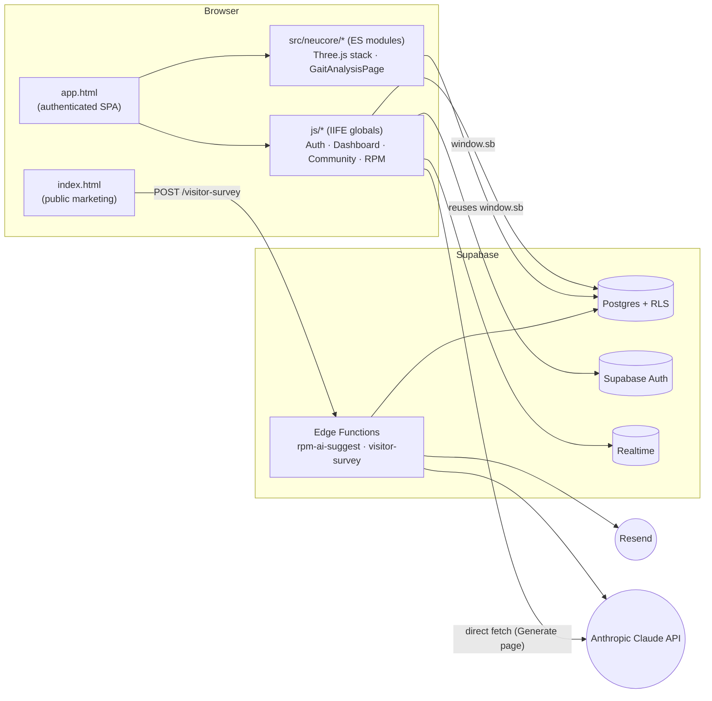

**Two surfaces, one Supabase project:**

- **Static front-end** (`index.html` + `app.html` + Vite-built `dist/`)
  serves both the public landing page and the authenticated dashboard.
- **Supabase** is the single backend: Postgres for data, Auth for
  identity, Realtime for live channels, and Edge Functions for the
  privileged work the browser can't safely do itself.

There is **no application server of our own** — every request from the
browser goes to Supabase (or to Claude directly, see §9).

---

## 2 · The Two-Layer Browser Stack

The browser code is intentionally split across two parallel layers.
Understanding this split is the **single most important thing** for a
new developer.

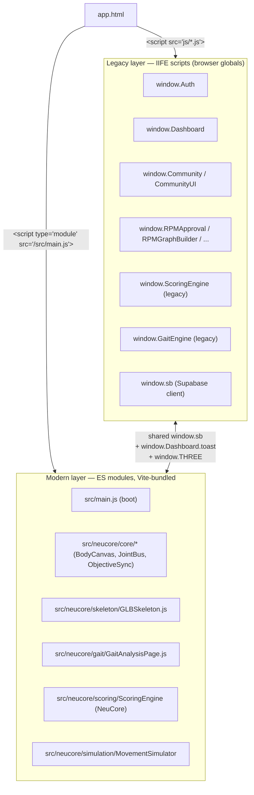

### Why two layers exist

The platform was built incrementally per
`AST9_MASTER_PROMPT_v3.md`'s **"PRESERVE FIRST"** directive: every new
feature plugs into the existing shell without breaking it. The original
codebase was vanilla IIFE scripts (no bundler). The 3D stack required
Three.js and its add-ons, which only work cleanly through a bundler —
so Vite + ES modules were introduced as a second layer alongside the
originals, sharing state through three intentional bridges:

| Bridge                | Direction               | Purpose                                                                  |
|-----------------------|-------------------------|--------------------------------------------------------------------------|
| `window.sb`           | Legacy → Modern         | One Supabase client, one auth session, shared by both layers.            |
| `window.THREE`        | Modern → Legacy         | Legacy `bodyMap3D.v2.js` reuses the same Three.js instance.              |
| `window.Dashboard`    | Modern → Legacy         | Modern code uses `Dashboard.toast(...)` for user-facing notifications.   |

### The duplicate-name trap

**There are two `GaitEngine`s and two `ScoringEngine`s** in this
codebase. They are different code with different responsibilities:

| Name           | Location                                     | Used by                              |
|----------------|----------------------------------------------|--------------------------------------|
| `GaitEngine` (legacy)   | `js/gaitEngine.js` → `window.GaitEngine`      | `Dashboard.generateProgram()` → legacy `#gait-panel` rendering. |
| `GaitEngine` (NeuCore)  | `src/neucore/gait/GaitEngine.js`              | `GaitAnalysisPage` → joint highlight cascade alongside `MovementSimulator`. |
| `ScoringEngine` (legacy)| `js/scoring.js` → `window.ScoringEngine`      | `Dashboard.generateProgram()` → score panel + AI prompt. |
| `ScoringEngine` (NeuCore)| `src/neucore/scoring/ScoringEngine.js`       | `GaitAnalysisPage._buildScoreSummary()`. |

> When you read `ScoringEngine.calculate(...)` in `js/dashboard.js`, it
> resolves to the **window global** from `js/scoring.js`. The
> `import { ScoringEngine } from '../scoring/ScoringEngine.js'` in
> `GaitAnalysisPage.js` resolves to the **NeuCore module**. They are
> different objects. Don't refactor one expecting the other to follow.

---

## 3 · Data Model

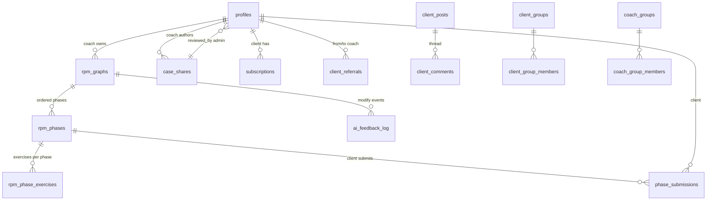

### Table reference (public schema)

| Table                       | Owner / scope        | Purpose                                                                  |
|-----------------------------|----------------------|--------------------------------------------------------------------------|
| `profiles`                  | per-user             | One row per `auth.users` row; carries `role` (`admin`/`coach`/`client`). |
| `subscriptions`             | per-client           | Drives the login subscription check (`Auth.checkSubscription`).          |
| `programs`                  | per-client           | Coach-published training programs.                                       |
| `client_programs`           | per-client           | Per-client published-program metadata (Phase 5).                         |
| `client_routines`           | per-client           | Daily routine templates.                                                 |
| `daily_routine_logs`        | per-client           | Per-day check-off records.                                               |
| `exercises`                 | shared library       | Master exercise library (filtered by phase + tags).                      |
| `exercise_playlists`        | per-coach            | Coach-curated exercise playlists.                                        |
| `progress_snapshots`        | per-client           | Time-series for the Progress Charts page.                                |
| `body_map_states`           | per-client           | Saved body-map states.                                                   |
| `rehab_objective_assessments` | per-client         | Objective assessment data (ROM, balance, screens).                       |
| `subjective_assessments`    | per-client           | Subjective intake.                                                       |
| `gait_assessments`          | per-session          | Per-Generate-run gait analysis output.                                   |
| `coach_messages`            | participant-scoped   | Direct messages between coaches.                                         |
| `coach_groups` / `coach_group_members` | participant-scoped | Coach communities.                                              |
| `client_referrals`          | from/to coach        | Refer a client between coaches.                                          |
| `case_shares`               | author-scoped        | Anonymized case studies (admin-moderated; see §6).                       |
| `client_posts` / `client_comments` | per-client    | Client community feed.                                                   |
| `client_groups` / `client_group_members` | per-client | Support groups.                                                        |
| `privacy_settings`          | per-user             | Per-user visibility controls for community features.                     |
| `rpm_graphs`                | per-coach (per-client) | Reactive phase plans (Point A → Point B).                              |
| `rpm_phases`                | per-graph            | Ordered phases inside a graph; carry tripwire criteria.                  |
| `rpm_phase_exercises`       | per-phase            | Exercise prescriptions for a phase.                                      |
| `phase_submissions`         | per-client per-phase | Client-submitted "I passed the tripwire" events.                         |
| `rpm_phase_messages`        | per-phase            | Phase-scoped coach ↔ client chat.                                        |
| `ai_feedback_log`           | per-graph            | Records every coach modification → used for downstream ML.               |
| `visitor_inquiries`         | public-writable      | Landing-page survey submissions (written by `visitor-survey` edge fn).   |

> The canonical DDL lives in `AST9_Phase3_Migrations.sql` (community +
> shared tables) and `supabase/migrations/*.sql` (Phase 5+, RPM,
> daily routine, client program publish, case study approval).

---

## 4 · Row Level Security

All public tables have RLS **enabled**. Three helper functions
(`SECURITY DEFINER`) gate the policies:

| Function                      | Returns `true` when                          |
|-------------------------------|----------------------------------------------|
| `public.is_admin()`           | `profiles.role = 'admin'` for `auth.uid()`   |
| `public.is_coach()`           | `profiles.role = 'coach'`                    |
| `public.is_coach_or_admin()`  | role ∈ {`coach`, `admin`}                    |

> **Operational note.** Every role that may run a query must have
> `EXECUTE` on every function the policy references — for the `anon`
> role too. Otherwise a logged-out request errors out instead of
> returning the rows its policy actually allows. See
> `supabase/migrations/20260523_case_study_approval.sql` for the
> canonical `GRANT EXECUTE ... TO anon, authenticated;` block.

### Policy patterns in use

| Pattern                    | Example                                                      | Where                                                 |
|----------------------------|--------------------------------------------------------------|-------------------------------------------------------|
| **Participants-only**      | `auth.uid() IN (sender_id, receiver_id)`                     | `coach_messages`, `client_referrals`                  |
| **Author + admin edit**    | `auth.uid() = owner_id OR public.is_admin()`                 | `case_shares` (delete), `client_posts` (own)          |
| **Public-when-approved**   | `status = 'approved' OR auth.uid() = author OR public.is_admin()` | `case_shares` (read)                              |
| **Admin-only mutation**    | `USING (public.is_admin()) WITH CHECK (public.is_admin())`   | `case_shares` (UPDATE — the approve/reject gate)      |
| **Privacy-aware**          | depends on `privacy_settings` join                           | `client_posts` (SELECT)                               |

### A subtle rule

For tables with **multiple permissive policies**, Postgres treats them
as `OR` — a row is visible if *any* policy passes. Several tables here
rely on this (e.g. `case_shares_read` for public approval-gating and
`case_shares_delete` for the author). When adding a policy, prefer
*adding alongside* rather than *replacing* unless you are intentionally
narrowing access.

---

## 5 · Authentication & Permissions

### Roles

There are three roles in `profiles.role`:

| Role     | Capabilities                                                                                       |
|----------|----------------------------------------------------------------------------------------------------|
| `admin`  | Everything coaches can do, plus: moderate case studies, manage coaches, see all data.              |
| `coach`  | Manage own clients, run assessments, publish programs, build RPM graphs, share case studies.       |
| `client` | View own program, check off daily routine, post in feed, submit phase tripwires, view own graph.   |

### Nav visibility

Sidebar items are role-gated via three CSS classes that `Dashboard`
toggles at boot ([`js/dashboard.js`](./js/dashboard.js) ≈ L40–55):

```js
document.querySelectorAll('.role-coach-admin').forEach(el => {
  el.style.display = Auth.isAdminOrCoach() ? '' : 'none';
});
document.querySelectorAll('.role-admin-only').forEach(el => {
  el.style.display = Auth.isAdmin() ? '' : 'none';
});
document.querySelectorAll('.role-client-only').forEach(el => {
  el.style.display = (Auth.getRole() === 'client') ? '' : 'none';
});
```

| Class               | Visible to             | Examples (in `app.html`)                                         |
|---------------------|------------------------|------------------------------------------------------------------|
| `role-coach-admin`  | coaches + admins       | Clients · Subscriptions · Exercise Library · Gait · Approvals    |
| `role-client-only`  | clients only           | My Graph · My Program                                            |
| `role-admin-only`   | admins only            | Coaches · Settings                                               |

> **Defence in depth.** Nav visibility is a UX convenience, not a
> security boundary. Authorization is enforced **at the database** by
> RLS — bypassing the nav (deep link, direct table call) still hits the
> policies.

### Client subscription gate

`Auth.login()` and `Auth.init()` both call `checkSubscription()` for
clients. An expired subscription blocks login entirely and the user is
signed out with an explanatory error. Coaches and admins are exempt.

---

## 6 · Request Lifecycles

### 6.1 · Generate program flow

The most complex flow in the system. A single button click triggers
**two independent code paths** (capture-phase listener and the
`onclick=` handler), each producing different output:

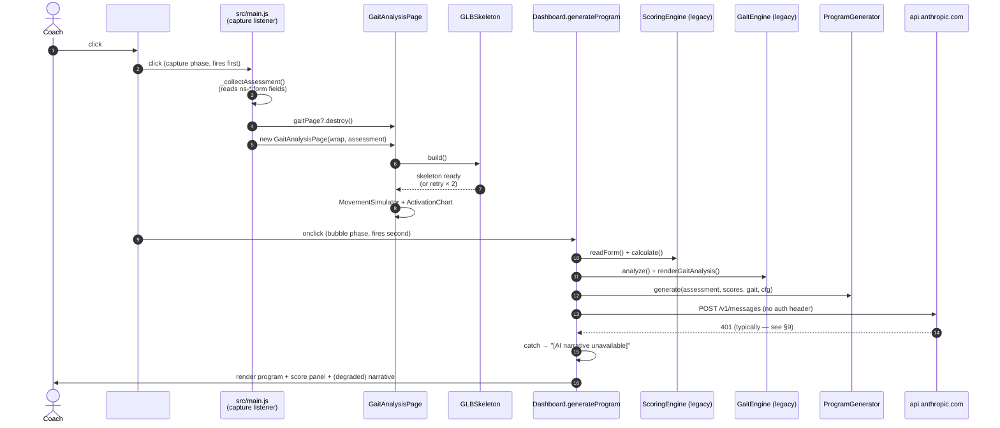

**Critical non-obvious behaviors:**

- The **capture-phase listener** runs *before* the bubble-phase
  `onclick`. This guarantees the gait page begins building even if
  `Dashboard.generateProgram()` rejects (e.g. no active client).
- The gait page and the legacy gait/scoring panels are **independent
  renders** — they don't share state. They can disagree.
- The direct call to `api.anthropic.com` ships **no `x-api-key`
  header**, so it is expected to fail in production. The catch block
  degrades gracefully — see [§9](#9--ai-integration--fallback-behavior).

### 6.2 · Case Study approval flow

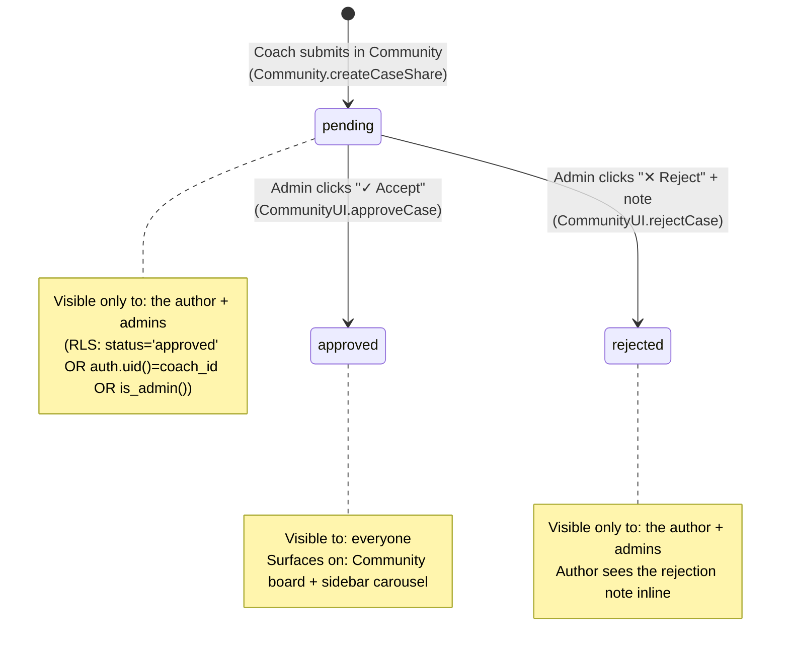

**Where it appears in the UI:**

- Submit → **Community → Case Studies** tab (any coach).
- Review → sidebar **Approvals** section (admin only;
  `#case-approvals-root`, rendered by `CommunityUI.renderCaseApprovals()`).
- Approved cards surface → sidebar **Case Studies** showcase
  (`PlatformExtras.initCaseStudiesCarousel`).

### 6.3 · RPM phase submission flow

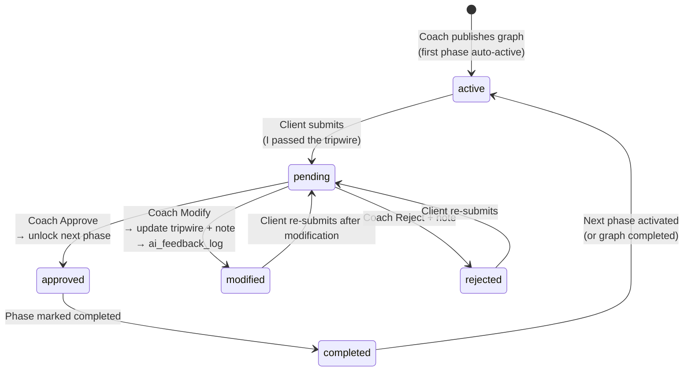

Implementation: [`js/rpm/approval.js`](./js/rpm/approval.js).

### 6.4 · Visitor survey flow

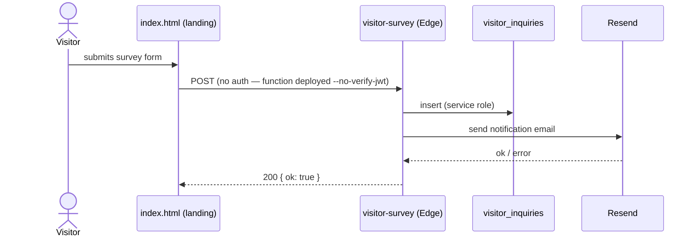

---

## 7 · Asset-Loading Architecture

The platform loads exactly one large asset: the 3.3 MB
`public/models/ecorche_humanoid.glb` anatomical skeleton.

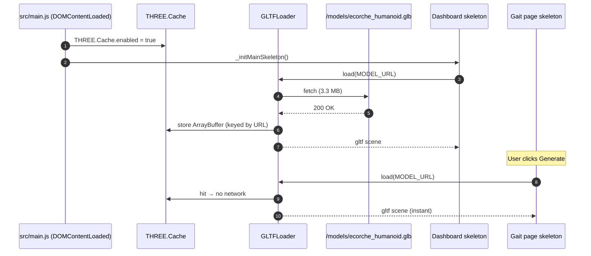

**Why this matters:**

- The dashboard skeleton boots during `DOMContentLoaded` and finishes
  long before the user clicks Generate.
- Without `THREE.Cache.enabled = true`, the gait page re-fetches the
  full 3.3 MB on each Generate click. A flaky network on that re-fetch
  surfaces as the user-visible **"3D anatomy failed to load"** error.
- `THREE.Cache` keys responses by URL inside `THREE.FileLoader`
  (`GLTFLoader` uses it internally), so the second load is a memory
  hit, not a network one.

### Retry + recoverable UI

Even with caching, `GLBSkeleton.build()` retries the underlying load
**twice** on a network-error callback (deterministic parse failures
are **not** retried — they would loop forever). If all retries fail,
`GaitAnalysisPage._initSimulation` shows the real error message and a
**↻ Retry** button that re-enters the method cleanly (it disposes the
old `BodyCanvas` and clears the wrap before retrying).

---

## 8 · Event Bus & State Synchronization

### JointBus

A tiny pub/sub at `src/neucore/core/JointBus.js` decouples the 3D
skeleton from anything that listens to joint events:

| Event                  | Payload                          | Emitted by                        | Listened by                                  |
|------------------------|----------------------------------|-----------------------------------|----------------------------------------------|
| `joint:select`         | `{ jointKey }`                   | BodyCanvas (raycaster click)      | main.js info bar, AssessmentPanel            |
| `joint:deselect`       | —                                | BodyCanvas                        | main.js info bar                             |
| `joint:hover`/`hoverout` | `{ jointKey }`                 | BodyCanvas                        | main.js hover label                          |
| `assess:painChange`    | `{ jointKey, value, color }`    | AssessmentPanel                   | main.js (`mainSkeleton.setJointPain`)        |
| `gait:phaseChange`     | `{ phase }`                      | MovementSimulator                 | GaitEngine, GaitAnalysisPage activation chart |
| `sim:phaseUpdate`      | `{ phase, phaseName }`           | MovementSimulator                 | (reserved for future overlays)               |

### ObjectiveSync — the hidden two-way bind

`src/neucore/core/ObjectiveSync.js` is a non-obvious but critical
module. It owns a **declarative table of bindings** (≈ 50 entries)
mapping each `ns-*` form field to its corresponding 3D joint:

```js
{ field: 'ns-hip-ir-l', joint: 'LeftHip',
  rom: 'hip_ir_left', norm: 40, kind: 'rom' },
```

| `kind`     | Direction                  | Behavior                                                                  |
|------------|----------------------------|---------------------------------------------------------------------------|
| `rom`      | **two-way**                | Form input ↔ joint color (deficit severity vs `norm`).                    |
| `time`     | form → 3D                  | Balance tests project onto the ankle joint.                               |
| `score`    | form → 3D                  | Functional screens (single-leg squat / RDL / OH squat) recolor.           |
| `checkbox` | form → 3D                  | Spine pain flags recolor `LumbarSpine`.                                   |

This is why **editing pain on a joint in the 3D pop-out updates the
form**, and vice-versa — a single store (`assessStore`) backs both.
Two separate skeletons are kept in sync: one in the dashboard
(`#bodymap-dashboard-container`) and one in the Objective tab
(`#neucore-body-canvas`).

---

## 9 · AI Integration & Fallback Behavior

There are **two AI integration paths** with different security postures:

### 9.1 · Generate-page narrative (browser → Anthropic directly)

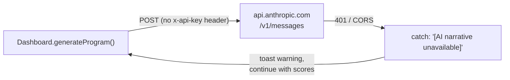

Implementation: [`js/dashboard.js`](./js/dashboard.js) ≈ L425. The
request is sent **without** an `x-api-key` header, so in production it
is expected to fail. The catch block downgrades the output to:

```
[AI narrative unavailable — check API key]

Scores: ROM 72% · Control 68% · Force 75% · Neurology 80%
Composite: 74% → Phase 2 — Strength & Control
```

**The clinical output (scores, gait deficits, program rules) is
unaffected.** Treat the narrative as a bonus.

> **Technical debt.** This call should be moved behind an edge function
> that injects `ANTHROPIC_API_KEY` from the project secrets, mirroring
> the `rpm-ai-suggest` pattern.

### 9.2 · RPM AI suggestions (edge function → Anthropic with fallback)

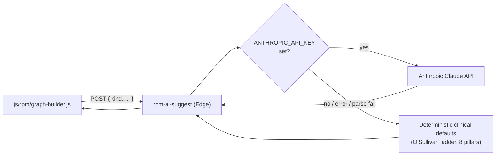

The function never blocks. If the key is missing or the model errors
or returns un-parseable output, it returns the clinical defaults so the
Graph Builder still works.

### Phase recommendation thresholds

For reference, the locked thresholds in `js/scoring.js`
`phaseRecommendation()`:

| Composite score | Recommendation                          | Referral?       |
|-----------------|-----------------------------------------|-----------------|
| ≥ 80            | Phase 3 — Performance                   | no              |
| ≥ 60            | Phase 2 — Strength & Control            | no              |
| ≥ 40            | Phase 1 — Foundation                    | no              |
| < 40            | Phase 1 — Foundation                    | **manual therapy** |

---

## 10 · Realtime Channels

| Channel name                  | Table              | Filter                          | Consumer                                          |
|-------------------------------|--------------------|----------------------------------|--------------------------------------------------|
| `messages_<uid>_<partnerId>`  | `coach_messages`   | `receiver_id=eq.<uid>`           | `Community.subscribeToMessages` (thread updates) |
| `client_posts_feed`           | `client_posts`     | none (INSERT)                    | `Community.subscribeToClientPosts` (feed prepend) |

Subscriptions are explicitly unsubscribed when the user navigates away
(`Community.unsubscribeMessages`, `unsubscribePosts`). Long-running
channels are intentionally minimal — most pages refetch on tab open
rather than subscribe.

---

## 11 · Edge Functions

| Function           | Purpose                                                          | Auth                          | Required secrets                                                                  |
|--------------------|------------------------------------------------------------------|-------------------------------|-----------------------------------------------------------------------------------|
| `rpm-ai-suggest`   | Phase + exercise suggestions for the Graph Builder.              | JWT required (default)        | `ANTHROPIC_API_KEY` (optional), `ANTHROPIC_MODEL` (optional, defaults `claude-sonnet-4-5`). |
| `visitor-survey`   | Landing-page inquiry intake + email notification.                | **no JWT** (`--no-verify-jwt`) | `RESEND_API_KEY`, `RESEND_FROM`, `NOTIFY_EMAIL` (optional).                       |

> **CORS note.** `visitor-survey` ships with
> `Access-Control-Allow-Origin: "*"` and a `// tighten to your domain
> in production` comment. Lock this down before going public.

Both functions auto-inject `SUPABASE_URL` and `SUPABASE_SERVICE_ROLE_KEY`
from the platform; you don't set those manually.

---

## 12 · Failure Recovery Paths

| Surface                       | Failure mode                          | Recovery                                                                                          |
|-------------------------------|---------------------------------------|---------------------------------------------------------------------------------------------------|
| Supabase paused (free tier)   | `signInWithPassword` times out        | `Auth.login()` waits 75 s then retries once after 3 s; on second timeout returns a friendly error. |
| GLB fetch                     | Network blip                          | `GLBSkeleton._loadWithRetry` retries twice with 600 ms backoff.                                   |
| GLB unrecoverable             | 404 / parse error                     | Loader replaced with real error text + **↻ Retry** button that re-enters `_initSimulation`.       |
| Gait page re-mount            | Rapid Generate clicks                 | `_buildToken` increment + `_disposed` flag invalidate the stale in-flight build.                  |
| Direct Anthropic call         | 401 / CORS                            | Caught, toast warning, score+program continue. See [§9.1](#91--generate-page-narrative-browser--anthropic-directly). |
| `rpm-ai-suggest`              | No key / parse fail                   | Function returns deterministic clinical defaults.                                                 |
| Coach modify in RPM           | Anything below `ai_feedback_log`      | The log insert is wrapped in `try { ... } catch (logErr) { console.warn(...) }` — non-fatal.      |
| Realtime subscription dropped | Channel disconnect                    | No automatic resubscribe — the user must navigate away and back. *(Known limitation.)*            |

---

## 13 · Permission / Access Flow Reference

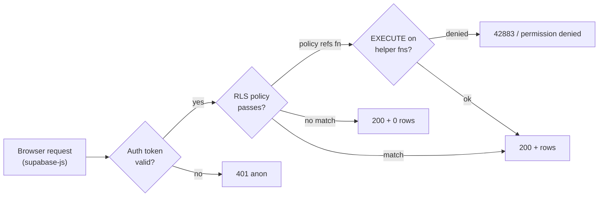

The historical gotcha: a policy that references `public.is_admin()` was
silently failing for the `anon` role because EXECUTE was never granted
to `anon`. That returned `permission denied for function is_admin`
instead of the expected empty list. The fix is in
`supabase/migrations/20260523_case_study_approval.sql`.
