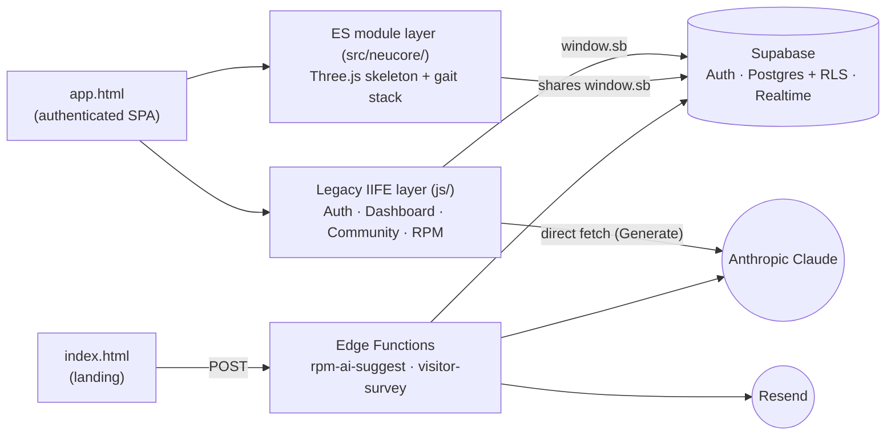

# AST9 Health Hub

A multi-disciplinary rehabilitation and coaching SaaS platform with a 3D
anatomical assessment engine, AI-assisted program generation, and a
collaborative coach/client community. **NeuCore** is the intelligence stack
inside the platform that powers movement scoring, gait analysis, and
phase-gated rehab planning.

> Live demo: <https://abdelrahmansabry1909-oss.github.io/AST9-platform/>

**Documentation map**

| File                                       | Audience                  | When to read                                              |
|--------------------------------------------|---------------------------|-----------------------------------------------------------|
| [`README.md`](./README.md)                                       | everyone                  | First. Project overview, install, run, deploy.            |
| [`Documentation.md`](./Documentation.md)                         | engineers + operators     | System internals: architecture, data model, RLS, AI flows. |
| [`Development.md`](./Development.md)                             | contributors              | Day-to-day: onboarding, debugging, common workflows, technical debt. |
| [`ArchitectureDecisionRecords.md`](./ArchitectureDecisionRecords.md) | architects + reviewers | Why the system was built this way. Risk register. Future ADRs. |
| `AST9_MASTER_PROMPT_v3.md`                                       | product / clinical        | Canonical platform specification.                          |
| `RPM_ARCHITECTURE_PLAN.md`                                       | engineers                 | Design rationale for the Reactive Phase Management module. |

---

## Overview

AST9 Health Hub is built around a single clinical workflow:

1. **Assess** a client through a structured subjective + objective intake
   (mapped onto an interactive 3D anatomical skeleton).
2. **Score** the result with the NeuCore engine (ROM, control, force,
   neurology, composite, phase recommendation).
3. **Analyze gait** through a real-time movement simulation that visualizes
   the client's deficits across a normative gait cycle.
4. **Generate** a phase-appropriate training program — exercise selection
   is driven by deterministic rule engines, then an AI narrative explains
   the clinical reasoning to the client.
5. **Coach** through a Reactive Phase Management (RPM) graph: clients
   submit when they pass a phase tripwire; coaches approve, modify, or
   reject.
6. **Collaborate** in Community: coach-to-coach messaging, client
   referrals, anonymized case-study sharing (admin-moderated), client
   feed, and support groups.

**Use cases:** rehabilitation specialists, athletic performance coaches,
bodybuilding / Pilates / yoga / mobility coaches, longevity-medicine
clinics, tactical / SOF training cadres, and concierge sports-medicine
practices that need an end-to-end clinical-grade pipeline on one
platform.

---

## Features

- **Auth & roles** — Supabase Auth with three roles: `admin`, `coach`,
  `client`; row-level security enforced at the database.
- **3D body map (NeuCore)** — anatomically real skeleton loaded from a
  glTF asset (`ecorche_humanoid.glb`), rendered with custom GLSL
  holographic shaders, hover/click-to-select joints, pain mapping.
- **Structured assessment** — subjective + objective intake, joint-level
  pain scoring, ROM / balance / single-leg / spine flags.
- **Scoring engine** — composite movement score over four sub-scores
  (ROM, control, force, neurology), with a banded phase recommendation
  (Phase 1 Foundation / Phase 2 Strength & Control / Phase 3 Performance)
  and a manual-therapy referral flag for sub-40 composites.
- **Gait Analysis page** — real walking-cycle simulation on the skeleton,
  deficit cards, normative-vs-client muscle activation chart, worst-case
  freeze analysis, hold-to-reveal worst-case projection.
- **Program generator** — rule-based exercise selection (warm-up /
  conditioning / cool-down split, A/B/C rotation) plus an optional AI
  clinical narrative via the Anthropic Claude API. The narrative
  degrades gracefully when the AI is unavailable; the scores and program
  are unaffected (see [Documentation.md §9](./Documentation.md#9--ai-integration--fallback-behavior)).
- **Daily Routine** — client tracker + coach adherence dashboard.
- **Reactive Phase Management (RPM)** — coach-built graphs of phased
  milestones with tripwire criteria, AI suggestions for phases and
  exercises, client viewer, coach approval queue (approve / modify /
  reject), AI feedback log for ML.
- **Community** — direct messaging, client referrals, **case-study board
  with admin approval workflow**, client posts/comments feed, support
  groups, per-user privacy settings.
- **Case Studies showcase** — admin-approved community case studies
  surface in a sidebar carousel (with marketing-card fallback when none
  approved yet).
- **Exercise Library** — searchable library + playlists.
- **Progress Charts** — per-client progress timelines (Chart.js).
- **Analytics** — platform-wide intelligence dashboard.
- **Professional PDF export** — full clinical report via jsPDF.
- **Landing page** — public marketing site (`index.html`) with a visitor
  inquiry survey backed by a Supabase Edge Function.

---

## Tech Stack

| Layer            | Technology                                              |
|------------------|---------------------------------------------------------|
| Language         | Vanilla JavaScript (ES2020+) · TypeScript (edge funcs)  |
| Bundler / Dev    | Vite 5                                                  |
| 3D engine        | Three.js 0.158 (GLTFLoader, custom GLSL shaders)        |
| Charts           | Chart.js 4.4                                            |
| PDF              | jsPDF (UMD)                                             |
| Auth + DB        | Supabase (PostgreSQL + Row Level Security)              |
| Realtime         | Supabase Realtime channels (messages, posts)            |
| Serverless       | Supabase Edge Functions (Deno)                          |
| AI               | Anthropic Claude API (`claude-sonnet-4-5` / equivalent) |
| Email            | Resend (transactional, via edge function)               |
| Hosting          | GitHub Pages (static) · Supabase (DB + functions)       |

The browser code is split in two layers that share a single `window.sb`
Supabase client:

- **Legacy IIFE scripts** under `js/` are loaded with classic `<script>`
  tags and expose globals (`Dashboard`, `Auth`, `Community`, …).
- **ES modules** under `src/neucore/` are loaded through Vite via
  `<script type="module" src="/src/main.js">` and own the 3D stack
  (`THREE`, scene, skeleton, gait simulator, scoring panels).

> The two layers contain **two different `ScoringEngine`s and two
> different `GaitEngine`s** that share names but not code. See
> [Documentation.md §2](./Documentation.md#2--the-two-layer-browser-stack)
> before refactoring either.

---

## Project Structure

```
.
├── index.html                       # Public marketing landing page
├── app.html                         # Authenticated SPA shell (dashboard)
├── package.json                     # Vite + Three.js + Chart.js + Supabase
├── AST9_MASTER_PROMPT_v3.md         # Canonical platform specification
├── AST9_Phase3_Migrations.sql       # Phase 3 schema (community + RLS)
├── RPM_ARCHITECTURE_PLAN.md         # Reactive Phase Management design
│
├── css/
│   ├── styles.css                   # App + community + dashboard styles
│   ├── styles_holographic.css       # NeuCore holographic shader styles
│   ├── neucore-design-system.css    # Design tokens
│   └── landing.css                  # Public landing page styles
│
├── js/                              # Legacy IIFE script layer (browser globals)
│   ├── supabaseClient.js            # Shared `sb` Supabase client
│   ├── auth.js                      # Login / role / session
│   ├── dashboard.js                 # Section routing + program generation orchestrator
│   ├── clients.js · subscriptions.js · exerciseLibrary.js · exerciseUI.js
│   ├── community.js · communityUI.js          # Messaging · referrals · case shares · feed · groups · privacy
│   ├── gaitEngine.js · scoring.js             # Legacy clinical engines
│   ├── programGenerator.js · programPublish.js · dailyRoutine.js
│   ├── charts.js · progressReport.js · pdfExport.js
│   ├── platformExtras.js                       # Sidebar Case Studies carousel
│   └── rpm/                                    # Reactive Phase Management
│       ├── graph.js · graph-builder.js · graph-viewer.js
│       ├── subjective.js · chat.js · approval.js · feedback.js
│
├── src/                             # Vite-bundled ES module layer
│   ├── main.js                      # Boot: skeleton, body map, Generate-page wiring
│   └── neucore/
│       ├── core/                    # BodyCanvas · FXLayer · JointBus · MaterialFactory · ObjectiveSync
│       ├── skeleton/                # GLBSkeleton (gltf loader + shaders + hotspots)
│       ├── panels/                  # AssessmentPanel · StatusPanel · PopPanel
│       ├── scoring/                 # ScoringEngine · AsymmetryDetector · PhaseGate
│       ├── simulation/              # MovementSimulator · MuscleActivationDB · ActivationChart
│       ├── gait/                    # GaitAnalysisPage · GaitEngine · GaitPhaseStrip · GaitRules · PhaseAnalysisOverlay
│       ├── program/                 # ProgramGenerator · RuleEngine
│       └── supabase/                # Typed wrappers (assessments · programs · bodyMapState)
│
├── public/
│   └── models/
│       ├── ecorche_humanoid.glb     # 3.3 MB anatomical skeleton asset
│       └── metadata_bundle.json
│
├── supabase/
│   ├── migrations/                  # Versioned SQL migrations
│   │   ├── 20260515_rpm_foundation.sql
│   │   ├── 20260516_rpm_phase5.sql
│   │   ├── 20260521_daily_routine.sql
│   │   ├── 20260522_client_program_publish.sql
│   │   └── 20260523_case_study_approval.sql
│   └── functions/                   # Deno edge functions
│       ├── rpm-ai-suggest/          # Claude proxy for phase + exercise suggestions
│       └── visitor-survey/          # Landing-page inquiry handler (Resend)
│
└── docs/
    └── rehab-book/                  # Clinical reference (O'Sullivan methodology)
```

---

## Installation

### Prerequisites

- **Node.js** 18+ (Vite 5 requirement)
- **npm** (or pnpm / yarn)
- A **Supabase** project (free tier is sufficient)
- Optional: **Supabase CLI** for migrations + edge function deploys
- Optional: **Anthropic API key** for live AI narrative generation
- Optional: **Resend API key** for landing-page survey emails

### Setup

```bash
# 1. Clone
git clone https://github.com/abdelrahmansabry1909-oss/AST9-platform.git
cd AST9-platform

# 2. Install dependencies
npm install

# 3. Provision the database
#    Either run the SQL files in supabase/migrations/ + AST9_Phase3_Migrations.sql
#    against your Supabase project in order, or use the Supabase CLI:
supabase link --project-ref <YOUR_PROJECT_REF>
supabase db push

# 4. Point the client at your Supabase project
#    Edit js/supabaseClient.js and replace SUPABASE_URL / SUPABASE_ANON
#    with the values from your project (Settings → API).

# 5. Drop the skeleton asset in place
#    public/models/ecorche_humanoid.glb must exist (3.3 MB).
#    The gait Movement Simulation will refuse to load without it.

# 6. (Optional) Deploy edge functions
supabase functions deploy rpm-ai-suggest
supabase functions deploy visitor-survey --no-verify-jwt
```

---

## Environment Variables

The browser app currently embeds `SUPABASE_URL` and the **public**
`SUPABASE_ANON_KEY` in `js/supabaseClient.js` — they are not loaded from
`.env`. The variables below are consumed by the Supabase Edge Functions
and should be set as **project secrets** in the Supabase dashboard
(*Edge Functions → Secrets*), not committed to the repo.

| Variable                    | Used by                            | Required        | Description                                                                                  |
|-----------------------------|------------------------------------|-----------------|----------------------------------------------------------------------------------------------|
| `SUPABASE_URL`              | both edge functions                | auto-populated  | Supabase project URL (injected by the platform).                                             |
| `SUPABASE_SERVICE_ROLE_KEY` | both edge functions                | auto-populated  | Service-role key — used for privileged writes (e.g. `visitor_inquiries`, `exercises` reads). |
| `ANTHROPIC_API_KEY`         | `rpm-ai-suggest`                   | optional        | Anthropic API key. When missing, the function falls back to deterministic clinical defaults. |
| `ANTHROPIC_MODEL`           | `rpm-ai-suggest`                   | optional        | Override the model. Defaults to `claude-sonnet-4-5`.                                          |
| `RESEND_API_KEY`            | `visitor-survey`                   | yes (for email) | Resend API key for the visitor inquiry email.                                                 |
| `RESEND_FROM`               | `visitor-survey`                   | yes (for email) | Verified Resend sender, e.g. `"NeuCore <hello@neucore.io>"`.                                  |
| `NOTIFY_EMAIL`              | `visitor-survey`                   | optional        | Destination inbox for landing-page inquiries.                                                 |

> The Anthropic key for the **Generate page's AI narrative** is not yet
> proxied through an edge function; calls to `api.anthropic.com` from
> the browser are best-effort and degrade gracefully if rejected.

---

## Running the Project

### Development

```bash
npm run dev          # Vite dev server on http://localhost:5173
```

Open `http://localhost:5173/` for the landing page, or
`http://localhost:5173/app.html?login=1` to jump straight to the sign-in
screen of the SPA.

### Production build

```bash
npm run build        # Static bundle in dist/
npm run preview      # Serve the built bundle locally for smoke-testing
```

### Tests

This codebase does not currently ship an automated test suite. Quality
gates are enforced by:

- The clinical specification in `AST9_MASTER_PROMPT_v3.md`
- Manual verification through `/app.html` against representative
  client scenarios
- Database-level Row Level Security policies as a defence-in-depth check

---

## Core Architecture



### Key flows

| Flow                          | One-line summary                                                                 | Deep dive |
|-------------------------------|----------------------------------------------------------------------------------|-----------|
| **Generate program**          | `#generate-btn` click fires *two* paths: a capture-phase listener that builds the NeuCore Movement Simulation, and `Dashboard.generateProgram()` that runs the legacy score/gait engines and requests an AI narrative. | [Documentation.md §6.1](./Documentation.md#61--generate-program-flow) |
| **Reactive Phase Management** | Coach builds a phase graph → client submits when they pass a tripwire → coach approves / modifies (logs to `ai_feedback_log`) / rejects.                                | [Documentation.md §6.3](./Documentation.md#63--rpm-phase-submission-flow) |
| **Case Study approval**       | Coach submits in Community (`pending`) → admin accepts (`approved`, visible everywhere) or rejects (`rejected`, only the author sees the note).                          | [Documentation.md §6.2](./Documentation.md#62--case-study-approval-flow) |
| **Visitor survey**            | Landing-page form → unauthenticated edge function → `visitor_inquiries` + email via Resend.                                                                              | [Documentation.md §6.4](./Documentation.md#64--visitor-survey-flow) |

For data-model, RLS, asset-loading, AI fallback, realtime, and
permissions reference see [`Documentation.md`](./Documentation.md).

---

## Usage Examples

### Authenticate against the database from a script

```js
import { createClient } from '@supabase/supabase-js';

const sb = createClient(
  'https://<YOUR-PROJECT>.supabase.co',
  '<YOUR-ANON-KEY>',
);

const { data: { user } } = await sb.auth.signInWithPassword({
  email:    'coach@example.com',
  password: '••••••••',
});
```

### List approved case studies (used by the sidebar carousel)

```js
const { data } = await sb
  .from('case_shares')
  .select('id,title,description,tags,coach:profiles!case_shares_coach_id_fkey(full_name)')
  .eq('status', 'approved')
  .order('created_at', { ascending: false })
  .limit(20);
```

### Admin approves a case study

```js
await sb.from('case_shares')
  .update({
    status:      'approved',
    reviewed_by: currentAdmin.id,
    reviewed_at: new Date().toISOString(),
  })
  .eq('id', caseId);
```

### Call the AI phase-suggestion edge function

```js
const res = await fetch(`${SUPABASE_URL}/functions/v1/rpm-ai-suggest`, {
  method:  'POST',
  headers: {
    'Content-Type':  'application/json',
    'Authorization': `Bearer ${session.access_token}`,
  },
  body: JSON.stringify({
    kind:   'phases',
    graph:  { point_a, point_b_dream, client_profile },
  }),
});
const { phases } = await res.json();
```

---

## Deployment

The repository targets a **two-surface deployment**:

1. **Static front-end** (landing + SPA) — `npm run build` produces a
   `dist/` directory that can be served from any static host. The
   reference deployment lives on GitHub Pages at
   <https://abdelrahmansabry1909-oss.github.io/AST9-platform/>.
2. **Supabase backend** — database schema is shipped as SQL files under
   `supabase/migrations/`; edge functions live under
   `supabase/functions/`.

### Reference workflow

```bash
# Front-end
npm run build
# upload dist/ to GitHub Pages / Vercel / Netlify / S3+CDN

# Database
supabase db push                              # or apply migrations in order

# Edge functions
supabase functions deploy rpm-ai-suggest
supabase functions deploy visitor-survey --no-verify-jwt

# Set secrets in the Supabase dashboard:
#   ANTHROPIC_API_KEY, RESEND_API_KEY, RESEND_FROM, NOTIFY_EMAIL
```

> Make sure `public/models/ecorche_humanoid.glb` is included in your
> deployed bundle — it is the source of the 3D skeleton and is loaded
> from `/models/ecorche_humanoid.glb` at runtime.

---

## Troubleshooting

| Symptom                                                       | Likely cause / fix                                                                                                                                                              |
|---------------------------------------------------------------|----------------------------------------------------------------------------------------------------------------------------------------------------------------------------------|
| Gait Movement Simulation shows **"3D anatomy failed to load"** | The `ecorche_humanoid.glb` asset is missing or 404s. Verify `public/models/ecorche_humanoid.glb` is present in the deployed bundle. Click the **↻ Retry** button to see the underlying error message. |
| Login hangs / times out                                       | Supabase project is paused (free tier auto-pauses after inactivity). Sign in once via the Supabase dashboard to wake it; the app retries automatically after ~3 s.               |
| `permission denied for function is_admin`                     | The `is_admin / is_coach / is_coach_or_admin / is_admin_or_coach` helpers need `GRANT EXECUTE ... TO anon, authenticated;`. See `supabase/migrations/20260523_case_study_approval.sql` for the canonical grants. |
| Carousel always shows the marketing cards                     | No case studies have been admin-approved yet (this is the fallback). Approve one from the sidebar **Approvals** section.                                                         |
| AI narrative says "[AI narrative unavailable]"                | The browser's direct call to `api.anthropic.com` was rejected. The Generate flow degrades gracefully; the scoring + program output are unaffected.                              |
| Edge function returns 401                                     | Either deploy with `--no-verify-jwt` (for public endpoints like `visitor-survey`) or pass `Authorization: Bearer <session.access_token>` from the client.                       |

---

## Contributing

The short version:

1. Fork the repository and create a feature branch:
   `git checkout -b feat/<short-description>`.
2. Match the existing architecture: legacy features → IIFE module under
   `js/`; 3D / NeuCore features → ES module under `src/neucore/`; DB
   changes → idempotent SQL migration under `supabase/migrations/`.
3. Never break existing RLS policies — add new ones alongside before
   dropping the old.
4. Clinical values (scoring formulas, normative ranges, gait mappings)
   are locked by `AST9_MASTER_PROMPT_v3.md` — do not approximate them.
5. Open a PR describing the change, the migration applied (if any), and
   a manual test plan.

The full version — onboarding, critical files, debugging entry points,
common workflows, performance notes, and the technical-debt register —
lives in [`Development.md`](./Development.md).

---

## License

No license file is included in this repository. The project is therefore
**all rights reserved** by default; contact the maintainer before
redistributing or using it in production.

Maintainer: **Abdelrahman Sabry** — <abdelrahman.sabry.1909@gmail.com>
