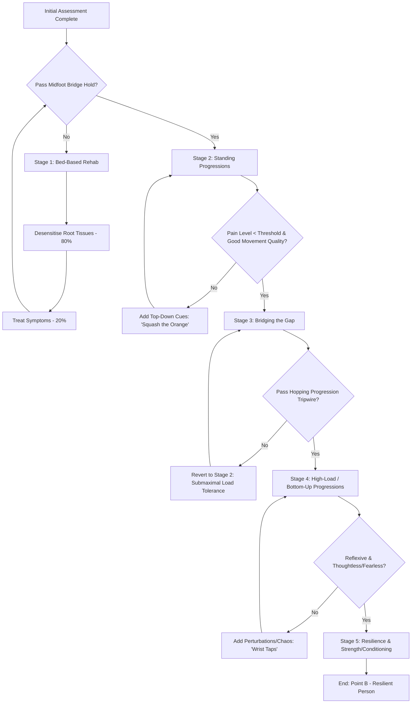

# Data Schemas, Decision Trees & Condensed Knowledge (Bonus — Section 8)

> **Note:** This file extracts the structured data templates and the decision-tree logic from the master content. Not in the workflow's expected file list, but it's a direct input to the data-model design in `RPM_ARCHITECTURE_PLAN.md`.

## 8.1 Structured Data Extraction

The following schema represents the clinical and business systems used to transition a patient from Point A to Point B.

### Table: GradedExposureLadder

| Field | Description / Example Values |
|---|---|
| `stage_number` | 1 (Entry), 2 (Standing), 3 (Bridging), 4 (High-Load), 5 (Resilient) |
| `stage_name` | Bed-based, Standing, Bridging the Gap, High-Load Loading, Resilience |
| `load_tolerance` | Submaximal (40–50%), Gravity-based, Impact-based, External Load |
| `movement_quality` | Guarded/Slow → Smooth/Fast → Thoughtless/Fearless |
| `entry_criteria` | KPI improvement on bed; ruled out red flags |
| `exit_criteria` | Passing stage-specific tripwire with no negative reaction |
| `tripwire_tests` | Midfoot bridge (30s hold), Hopping progressions (Leap, Stick, Continuous) |
| `top_down_cues` | Conscious intent: "Squash an orange through the midfoot" |
| `bottom_up_cues` | Reflexive: "Reach for the wall," "Wrist taps," rapid perturbations |

### Template: SubjectiveAssessment

| Field | Type | Scoring / Rationale |
|---|---|---|
| `dream_outcome` | Internal Motivator | The "Northern Star"; happiness = reality – expectations |
| `external_pain` | External Problem | Often just a symptom; not the most valuable problem to solve |
| `life_impact` | Internal Motivator | "What is the pain stopping you from doing?" |
| `mechanism_of_injury` | Objective Link | Connects tissues shortening / lengthening to movement strategy |
| `stress_timeline` | Objective Link | Connects respiratory / nervous-system sensitisation to peripheral pain |
| `confidence_score` | Likelihood (1–10) | Patient's belief in achievement; affects adherence strategy |
| `importance_score` | Likelihood (1–10) | "How important is this to get sorted right now?" |

### Table: Milestone (D.O.M.S. Framework)

| Field | Description / Example Values |
|---|---|
| `milestone_name` | "Walk up stairs," "Hop pain-free," "Run 5K" |
| `session_target` | Session 1 (Fast Start), Session 4 (Bridge Gap), Session 8 (Discharge) |
| `validation_criteria` | Passing a specific KPI (e.g., hip flexion pinch resolved) |
| `emotional_win` | "Picking up grandkids," "Sleeping through the night" |

### Table: PatientJourneyPhase

| Phase Name | Emotional State | Dropout Risk | Intervention |
|---|---|---|---|
| Starting | Hopeful / Skeptical | Moderate | Rapport, Start Fast, Effective Explanation |
| Nervous / Skeptical | Self-doubt / Fear | High | Pre-framing objections, hitting Milestone 1 |
| Solidifying | Confident | Low | Transitioning to bottom-up (reflexive) rehab |
| Expanding / Improving | Empowered | Very Low | Resilience, Strength & Conditioning |

### Structure: TreatmentPlan

- **80/20 Time Split:** 80% on the True Driver (Root Cause); 20% on Symptoms.
- **Inversion Destination:** Point B defined by asking "What needs to happen before you are confident to do [Dream Outcome]?"
- **Fast Start Milestone:** Immediate win in Session 1 to provide "emotional buy-in".
- **Pre-framed Objections:** Addressing the "I feel fine at Session 4 and want to run" trap early.

---

## 8.2 Decision Tree / Graph Logic

---

## 8.3 The Complete Condensed Knowledge Document

### Core Philosophy

The 'Go-To' Therapist method is built on **Second-Order Thinking**. While first-order thinking treats immediate symptoms (massaging a tight muscle), second-order thinking identifies the root driver (e.g., a tight hamstring as a reaction to a sensitised diaphragm). The system follows an **80/20 Rule**: spend 80% of treatment time on the true driver found in the patient's history and 20% on desensitising symptoms.

### Subjective Assessment Question Bank

**Aims:** Build rapport, identify Internal Motivators, establish the Injury Timeline, and rule out Red Flags.

**Rationale Questions:**
- "What is the pain stopping you from doing?" *(Uncovers Internal Motivators)*
- "What needs to happen before you are confident to do [Dream Outcome]?" *(Inversion Principle)*
- "On a scale of 1–10, how confident are you that this will get sorted?" *(Perceived Likelihood)*

### Objective Assessment: The 3-Layer Framework

- **Layer 1 — Generic Assessment:** 30,000-foot view of big movements (toe-touch, side flexion). Observe if the patient challenges their base of support.
- **Layer 2 — Passive Assessment:** Zoom in on motor adaptations. Avoid treating the first adaptation seen; cross-link with the subjective story.
- **Layer 3 — Coordinative Testing:** Test Force Steadiness at submaximal levels (40–50%). Identify "perceived threats" by seeing how the body reacts to perturbation.

**The 3 Critical Questions:**
1. What are the possible reasons they are moving this way?
2. What isn't happening that, if it did, would cause symptoms to disappear?
3. What is happening that, if it stopped, would cause symptoms to disappear?

### The Graded Exposure Ladder

- **Stages:** Bed → Standing → Bridging → High-Load → Resilience
- **Tripwires:** The Midfoot Bridge Hold (30s) ensures readiness for standing; Hopping Progressions ensure readiness for running
- **Progression Rules:** Patients must "earn the right" to progress by passing tripwires and improving KPIs

### Patient Adherence & Effective Explanation

- **3-Step Framework:** Explain the Problem, the Solution, and the Plan
- **Visual Method:** Use simple stick-figures and percentages to show Point A (current state) vs. Point B (dream outcome)
- **Fogg Behavior Model (B = MAP):** Ensure exercises have high Motivation (linked to milestones), high Ability (easy / pain-free), and a clear Prompt (e.g., "every time you use the stairs")

### The 8-Pillar System Overview

1. Subjective Assessment
2. Objective Assessment
3. Effective Explanation
4. Treatment Plan Design
5. Hands-on Treatment
6. Low-Level Rehab
7. Bridging the Gap
8. Strength & Conditioning

### Case Study Summary

A 75-year-old female with 8 years of chronic back pain. Assessment revealed poor right-leg load tolerance due to an old ankle sprain. By focusing 80% on the leg driver and 20% on back symptoms, the therapist hit milestones (lifting her husband, shopping, gardening) sequentially, moving her from top-down guarded movement to thoughtless, fearless movement.

### Key Terminology Glossary

| Term | Definition |
|---|---|
| Motor Adaptation | Protective strategies the nervous system implements to offload stress |
| Thoughtless, Fearless Movement | Moving without conscious worry or pre-planning |
| Top-Down vs. Bottom-Up | Top-down is conscious / cued; bottom-up is reflexive / automatic |
| KPI | A measurable objective marker (e.g., a specific joint range) used to check if treatment is working |
| D.O.M.S. | Dream Outcome, Milestones, Start Fast |
